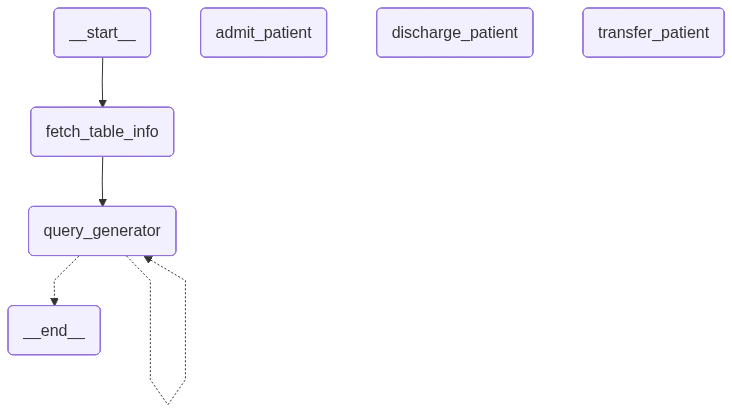

# Surgi-Sync

**Multilingual AI that connects voices, data, and care inside and outside the OR**

Surgi-Sync is a comprehensive AI-driven hospital assistant designed to streamline patient management, surgery documentation, and doctor consultation. Leveraging **Boson AI Higgs Audio V2 model** for voice transcription and feedback, Surgi-Sync integrates multiple hospital workflows into a single intelligent platform.

---

## Features

* **Voice-activated patient management:** Admit, discharge, and transfer patients in real-time using natural speech and get hospital beds status.
* **Surgical transcription:** Record and timestamp surgery conversations for accurate documentation and future reference.
* **Doctor AI assistant:** Query patient status, generate surgery reports, and review transcripts.
* **Multilingual support:** Responses and outputs can be generated in multiple languages supported by Boson AI.
* **Database-driven:** All patient, surgery, and doctor interactions are stored for reliable retrieval and reporting.

---

## Modules

### 1. Emergency Room Assistant

* Enables nurses to manage multiple patient admissions vocally using an **agentic workflow**, where the system interprets instructions and autonomously executes the required actions.
* Sample command: `"Patient with ID 101 needs to be admitted with heavy nose bleeding"`
* Supports operations:

  * `admit patient`
  * `discharge patient`
  * `transfer patient`
  * `query patient or room status`
* Voice input is processed via **Boson AI Higgs Audio V2 Model** for real-time transcription and audio feedback.
* The agentic workflow ensures that instructions are dynamically interpreted, checked against current patient/room data, and executed with minimal manual intervention.
* Information can be displayed live on the interface for quick reference.



### 2. Surgery Room Recorder

* Continuously records surgical conversations with precise timestamps.
* Automatically transcribes audio for storage and report generation.
* Serves as a reliable archive for surgery documentation.

### 3. Doctor Room Assistant

* Provides an AI interface for doctors to query patient data, review surgery transcripts, and generate reports.
* Answers queries using patient records and transcribed surgery data.
* Supports multiple languages for communication and report generation.

---

## Architecture Overview


*The architecture visualizes the three modules, voice/audio flow, data storage, and AI processing pipelines.*

LLM as a Reasoning Engine: We are using the Groq LLM (llama-3.3-70b-versatile) not just for simple generation, but as the core "brain" to understand requests and make decisions.

Intent Classification & Routing: The system first uses the LLM to classify the user's intent (admit, discharge, query, etc.). This classification acts as a decision to route the request to the appropriate specialized function (your "tools").

Tool Use: The functions like admit_patient_tool, discharge_patient_tool, record_surgery_comment_tool, and answer_general_query_tool serve as tools that the agent calls upon to interact with the external world (your JSON files and SQLite database) and perform specific actions. Some tools even use the LLM again for sub-tasks like data extraction.

Retrieval-Augmented Generation (RAG): The answer_general_query_tool is a classic example of a RAG agent. It retrieves information from external knowledge sources (databases, json files) and uses the LLM to generate an informed answer based on that retrieved context.
---

## Requirements

* Python 3.10+

```bash
pip install -r requirements.txt
```

* **Boson AI API key** for audio transcription and feedback

---

## Setup & Running

1. **Clone the repository**

```bash
git clone https://github.com/SurgiSync/SurgiSync.git
cd surgi-sync
```

2. **Install dependencies**

```bash
pip install -r requirements.txt
```


3. **Configure environment variables**
```bash

In the Streamlit secrets file, input the BOSON_API_KEY and GROQ_API_KEY
```


5. **Run the modules**

* **Emergency Room Assistant:**

```bash
streamlit run Patient_Query_&_Status.py
```


6. **Using the system**

* Speak commands in ER or Surgery room modules to trigger actions.
* Doctors can query the system via text or voice for real-time patient information and report generation.

---

## Notes

* Ensure **microphone access** is enabled for voice modules.
* The system relies on Boson AI for transcription and audio responses. Ensure the API key is valid.
* Multi-language output requires configuring the desired language in the doctor or ER module.

