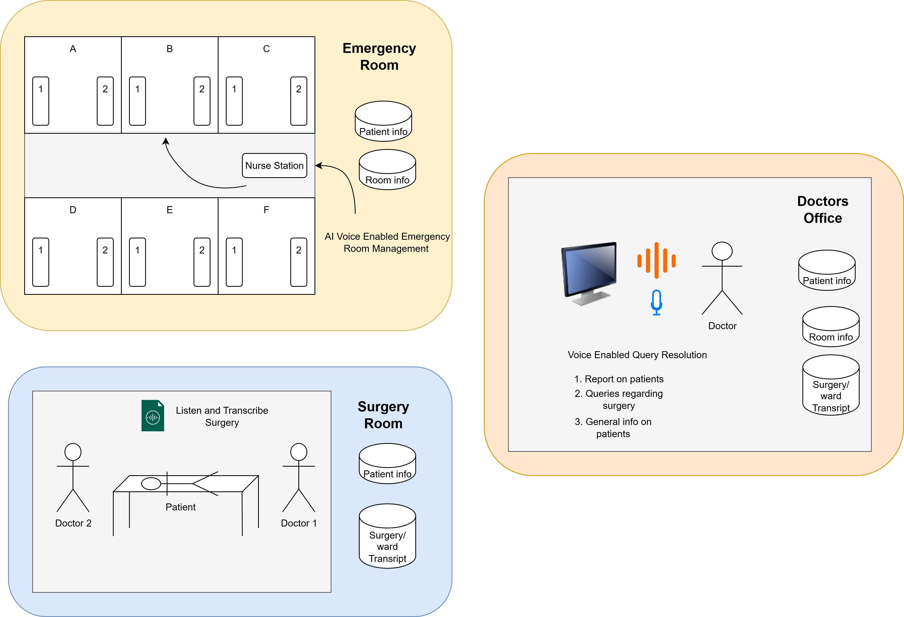

# Surgi-Sync

**AI that connects voices, data, and care inside and outside the OR**

Surgi-Sync is a comprehensive AI-driven hospital assistant designed to streamline patient management, surgery documentation, and doctor consultation. Leveraging **Boson AI Higgs Audio V2 model** for voice transcription and feedback, Surgi-Sync integrates multiple hospital workflows into a single intelligent platform.

---

## Features

* **Voice-activated patient management:** Admit, discharge, and transfer patients in real-time using natural speech.
* **Surgical transcription:** Record and timestamp surgery conversations for accurate documentation and future reference.
* **Doctor AI assistant:** Query patient status, generate surgery reports, and review transcripts.
* **Multilingual support:** Responses and outputs can be generated in multiple languages supported by Boson AI.
* **Database-driven:** All patient, surgery, and doctor interactions are stored for reliable retrieval and reporting.

---

## Modules

### 1. Emergency Room Assistant

* Enables nurses to manage multiple patient admissions vocally.
* Sample command: `"Patient with ID 101 needs to be admitted with heavy nose bleeding"`
* Supports operations:

  * `admit patient`
  * `discharge patient`
  * `transfer patient`
  * `query patient or room status`
* Voice input is processed via **Boson AI Higgs Audio V2 Model** for real-time transcription and audio feedback.
* Information can be displayed live on the interface for quick reference.

### 2. Surgery Room Recorder

* Continuously records surgical conversations with precise timestamps.
* Automatically transcribes audio for storage and report generation.
* Serves as a reliable archive for surgery documentation.

### 3. Doctor Room Assistant

* Provides an AI interface for doctors to query patient data, review surgery transcripts, and generate reports.
* Answers queries using patient records and transcribed surgery data.
* Supports multiple languages for communication and report generation.

---

## Architecture Overview


*The architecture visualizes the three modules, voice/audio flow, data storage, and AI processing pipelines.*

---

## Requirements

* Python 3.10+
* SQLite (or compatible database)
* Dependencies (install via pip):

```bash
pip install -r requirements.txt
```

* **Boson AI API key** for audio transcription and feedback

---

## Setup & Running

1. **Clone the repository**

```bash
git clone https://github.com/your-repo/surgi-sync.git
cd surgi-sync
```

2. **Install dependencies**

```bash
pip install -r requirements.txt
```

3. **Configure environment variables**
   Create a `.env` file with:

```env
BOSON_API_KEY=your_boson_api_key_here
DATABASE_URL=sqlite:///surgisync.db
```

4. **Initialize the database**

```bash
python scripts/init_db.py
```

5. **Run the modules**

* **Emergency Room Assistant:**

```bash
python modules/emergency_room.py
```

* **Surgery Room Recorder:**

```bash
python modules/surgery_room.py
```

* **Doctor Room Assistant:**

```bash
python modules/doctor_room.py
```

6. **Using the system**

* Speak commands in ER or Surgery room modules to trigger actions.
* Doctors can query the system via text or voice for real-time patient information and report generation.

---

## Notes

* Ensure **microphone access** is enabled for voice modules.
* The system relies on Boson AI for transcription and audio responses. Ensure the API key is valid.
* All patient data is stored in the SQLite database for offline and persistent access.
* Multi-language output requires configuring the desired language in the doctor or ER module.

